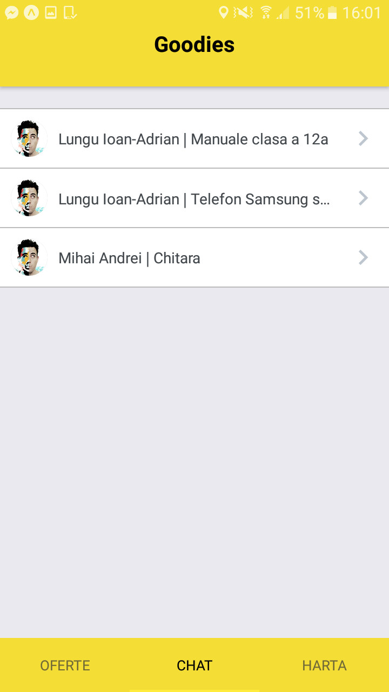
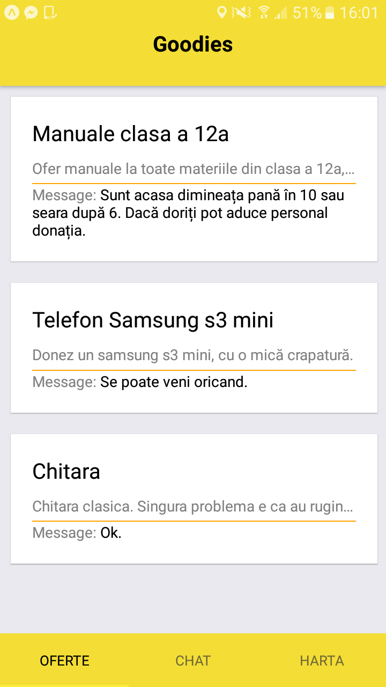
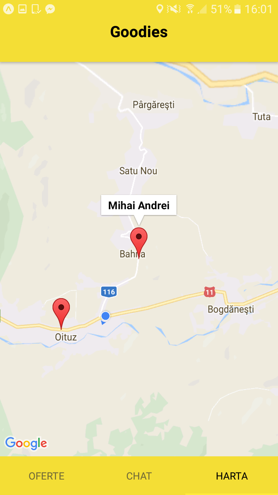
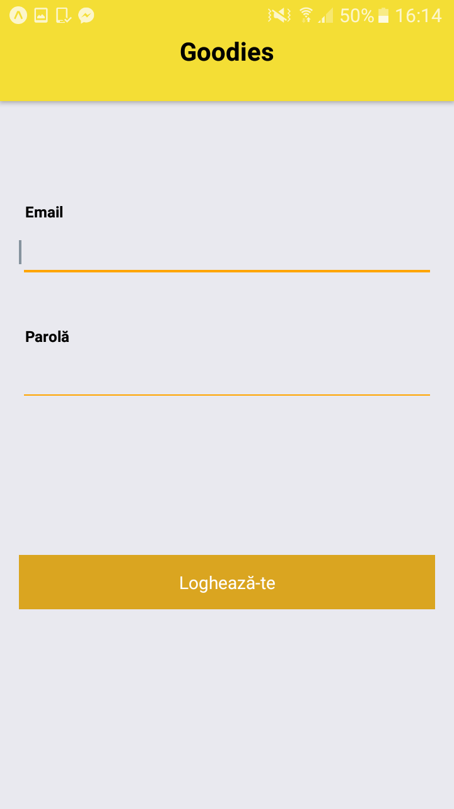
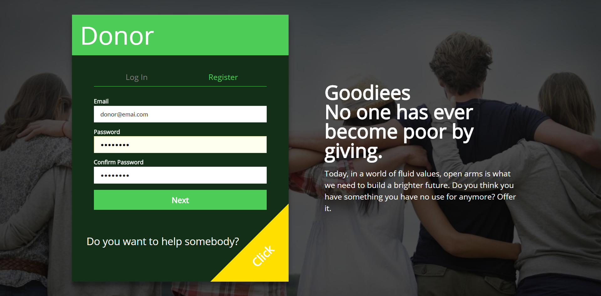
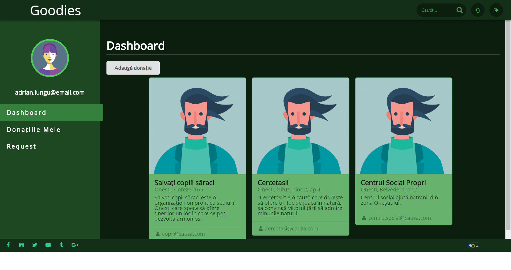

# Goodies
Goodies. Un site unde poți ajuta din conforul casei tale.

Proiectul este întreținut pe un repository privat, dându-se push periodic pe github.

Goodies este alcatuit din 3 parți: un backend(făcut în java spring), frontend facut în react(cu redux, sagas) și o aplicație de mobile făcută în react-native (cu expo, redux și sagas).

Poze cu ui-ul se gasesc în folderul *photos* din acest repository.

## Instalare frontend

Deschideți un terminal in folderul goodies-ui și rulați comanda:

```
npm install
```

După rulați:

```
npm start
```

pentru a porni serverul de webpack. După compilare serverul se poate accesa pe:

```
http://localhost:8000
```

## Instalare backend

### Baza de date

Baza de date este mysql. Serverul de backend folosește liquibase pentru migrarea schemei. Este necesară crearea unei scheme de mysql cu numele **donesti**. Tabelele sunt create automat la rularea serverului preluând informațiile din *resources/db/changelog-x.xml*

### Server

Spring boot permite rularea serverului ca o aplicație java normală prin funcția *main* din **DonestiApplication**

## Mobile

Deschideți un terminal in folderul goodies-ui și rulați comanda:

```
npm install
```

!! Ca tab-ul de map să fie funcțional este nevoie de o cheie de google maps!

În *goodies-mobile/App.config* se redenumește fisierul **privateKeysRename.js** în **privatKeyRename.js** și se setează un key de google maps.
!! La momentul actual *react-navigation* are un bug ce nu permite schimbarea tab-urilor decât prin swipe dacă debugger-ul e pornit.

Fiind o aplicație expo se pot urma pașii din guide-ul: https://docs.expo.io/versions/latest/introduction/installation.html
___

!! Atat front-endul cat si aplicația de mobil au nevoie de serverul de backend pentru a putea fi funcționale.
___


Chat mobile                                        |  Donatii mobile
:-------------------------------------------------:|:-------------------------:
   | 

Harta donatori mobile                              |  Login mobile
:-------------------------------------------------:|:-------------------------:
  | 


Login web                                          |  Register web                                      |  Dashboard Web
:-------------------------------------------------:|:--------------------------------------------------:|:---------------------
  |   |  
